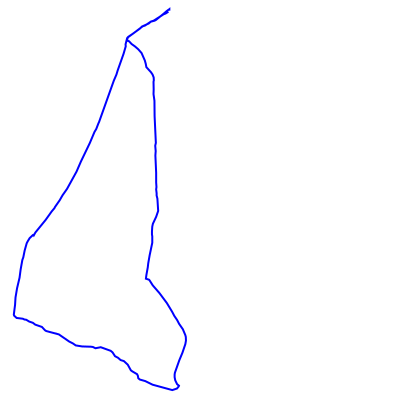

# Polyline to SVG

Convert a collection of Google Map polyline encoded strings to SVG.

Place each polyline as a `.txt` file in the `polylines` folder, then
run `npm start`. This will generate the individual SVG files in the `dist`
folder and an `index.html` to view as a webpage.

## Example

The `example.txt` polyline has been converted to the following SVG;

```plain
ixgaIpzfKLb@DXp@~BD^AAP`@VvALTbAxCHHLBBABUTa@Pi@Ti@\k@x@i@XKXGf@{@PSTMTAJBz@Ab@@r@KvBAnEOTFh@E`@BfCIhA?b@CPB\EP?VI~AIl@Xt@h@TFd@BV?LCp@?`B`@|@P^Dz@PZDFg@BEf@i@z@uAlA_BbAcA^[^c@\Yh@o@l@_@LEZAZFbAd@x@f@~Av@LBT?VG\WJWDBNTJz@i@|F[|AKdAIRSDKHU|@GPk@f@[p@Gh@Q`@Kd@]^KV[~BFbAI`@AXAnBGpAOd@Ml@w@dCY`DENYf@QtAM\In@Md@AVEREnAQ^GBkAOy@EgASqA_@_AMiAUSKu@Qw@YMKYYWi@AGBCUSaBcCaAmAYc@GEu@}@e@c@q@y@eCyBmAw@qCsBuA{@UUk@[IGaI}Do@a@_@OaCkAy@[O@o@SIMY_Aw@yBE]]iAGq@EQo@aBSe@Oc@
```


